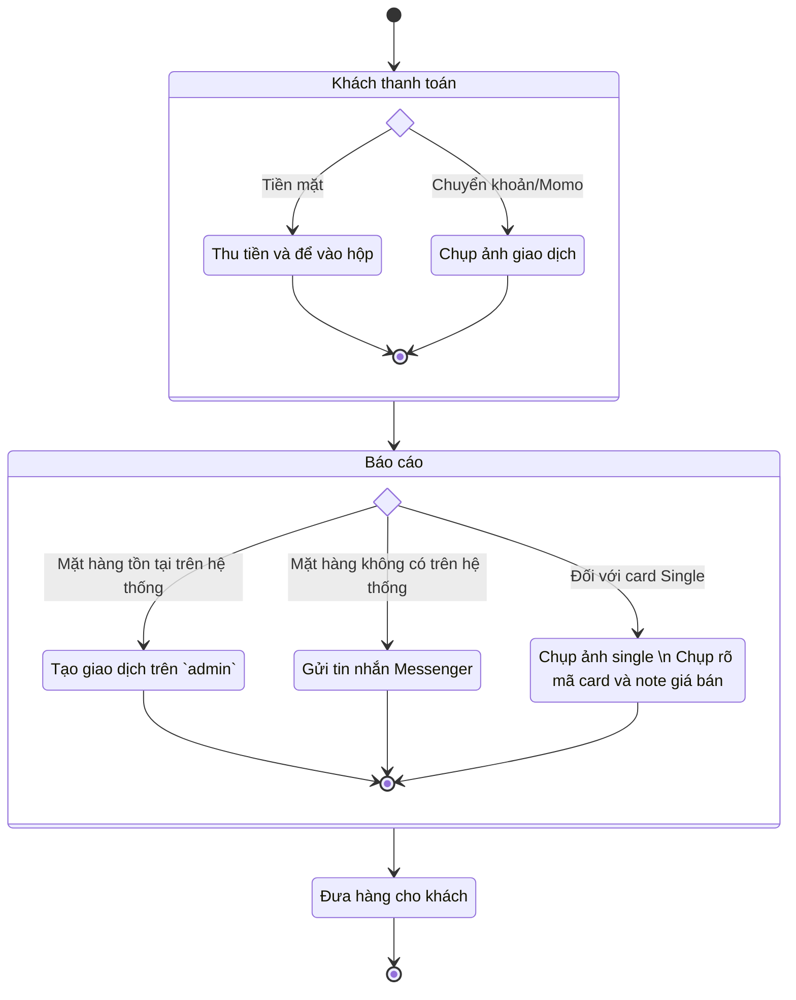

# Quy trình bán hàng

Từng bước diễn ra khi khách hàng đến trải nghiệm dịch vụ và mua sắm ở cửa hàng.

## Kịch bản thường gặp

**Bước 1:** Chào hỏi và làm quen với khách (mới). Nắm bắt rõ nhu cầu của khách đến cửa hàng.

**Bước 2:** Nếu khách mua mang đi thì có thể bỏ qua bước này. Nếu khách ngồi lại thì mời khách đi gửi xe.

Địa chỉ gửi xe: Chung cư 137 Bùi Hữu Nghĩa.

**Bước 3:** Nếu là khách mới hãy tìm hiểu các thông tin cần thiết của khách (Customer Insight) 

- Làm cách nào khách biết đến shop (facebook, youtube, bạn bè giới thiệu, ...)
- Khách quan tâm đến mặt hàng nào (Yugi TCG, Yugi OCG, One Piece, Lorcana,...)
- Khả năng chi tiêu của khách (bóc pack, single, in card,...)

**Bước 4:** Khi khách đến để giao lưu ngồi lại, nhớ thường xuyên chào mời hàng cho khách mua:

- Mời bóc pack
- Mời uống nước
- Mời ăn mỳ/bánh

**Bước 5:** Khi khách mua hàng tiến hành thực hiện `kịch bản bán hàng`.

## Kịch bản bán hàng

:::note[Ghi chú]

Tham khảo thêm __Hỗ trợ kĩ thuật__ để biết ` Tạo giao dịch ` trên hệ thống `admin`

:::